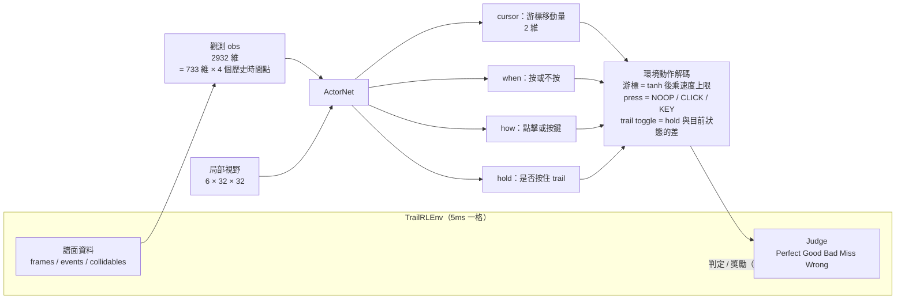
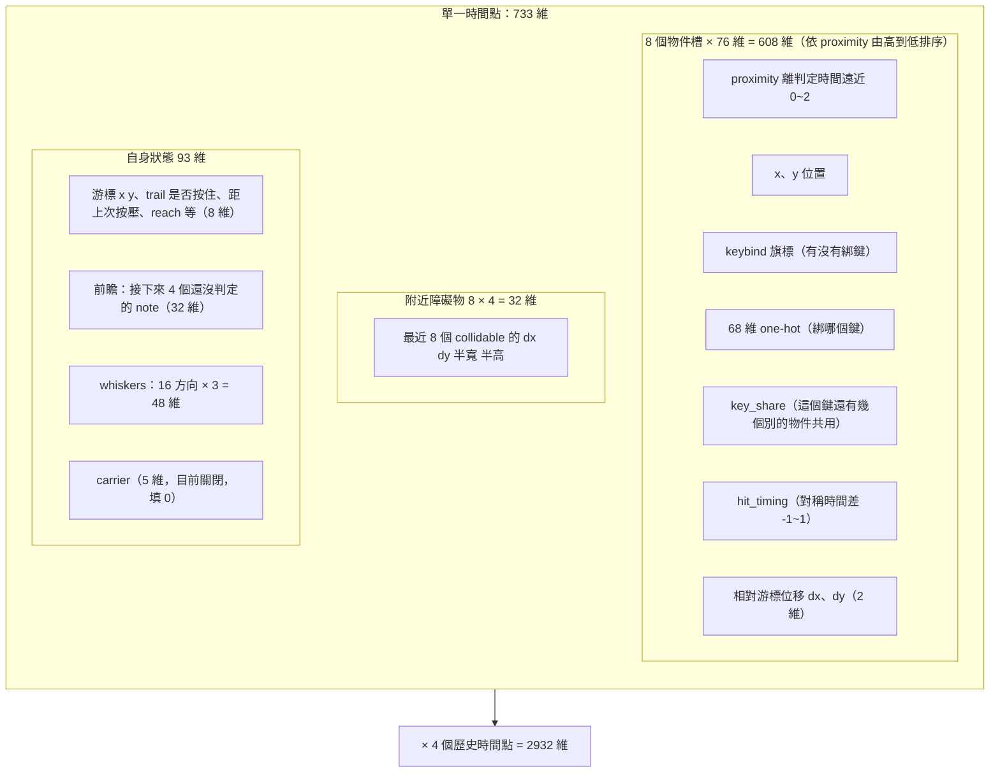
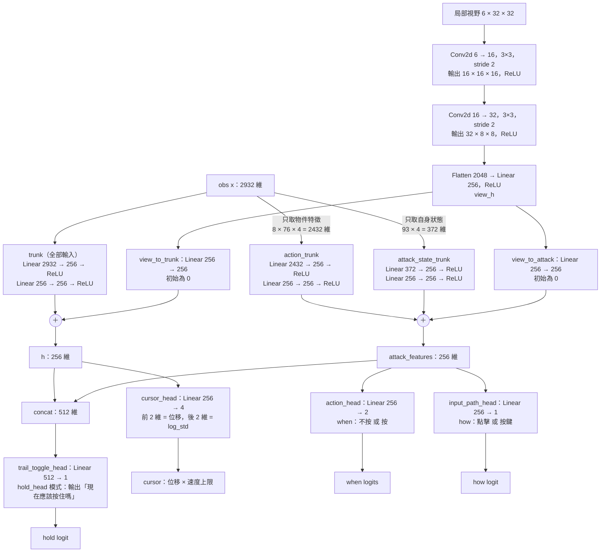
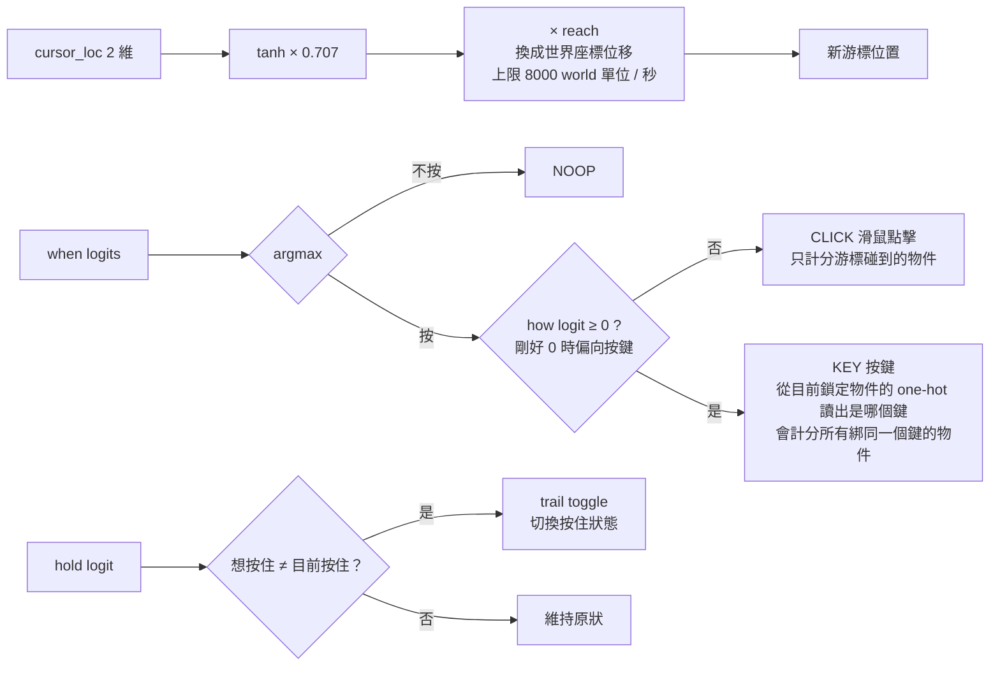
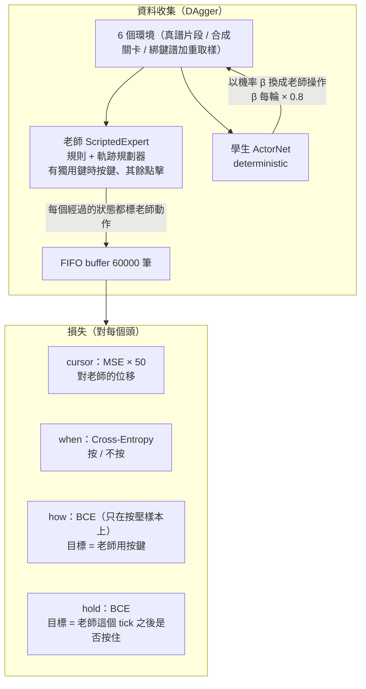
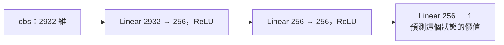

# 目前模型架構（ActorNet，bc18~bc21 系列）— 詳細版

來源：`training/rl_policy.py`（`ActorNet`、`CriticNet`）、`training/rl_env.py`（觀測與動作）、`training/train_bc.py`（損失）。

> 這份文件分兩層讀：每一節開頭的「**白話**」不需要任何機器學習背景；後面的圖與維度表是給想對照程式碼的人。
> 看不懂的詞先翻到最後一節「名詞對照」。

---

## 0. 先用一段話講完整件事

這個模型是一個「**會玩 ybnote 的 AI**」。遊戲每 **5 毫秒**（一個 tick）問它一次：

> 「現在畫面是這樣，你要怎麼做？」

它每次要回答 4 件事：

1. **游標往哪裡移動多少**（滑鼠要去哪）
2. **現在要不要按**（按 or 不按）
3. **要按的話，用滑鼠點擊還是鍵盤按鍵**
4. **要不要按住滑鼠（trail 拖曳）**

它是怎麼學會的？**不是自己亂試**（那是 RL），而是**看老師示範再模仿**（BC，Behavior Cloning）：
有一個用規則寫成的「老師」（`ScriptedExpert`），學生（ActorNet）看老師在同一個畫面會做什麼，然後努力做得一樣。

整個流程可以想成：

```
關卡資料 ──► 整理成「觀測」(一長串數字) ──► 神經網路 ──► 4 個答案 ──► 變成遊戲動作 ──► 遊戲判定
```

---

## 1. 總覽：環境 → 觀測 → 網路 → 動作 → 環境

**白話**：左邊是遊戲模擬器（環境），它把譜面資料整理成一長串數字（觀測）。網路讀這串數字（外加一張游標周圍的小地圖），吐出 4 個答案。答案被翻譯成真正的遊戲動作，送回遊戲，遊戲給出判定（Perfect / Good / Bad / Miss / Wrong）。
**BC 訓練時不看判定**，判定只有 RL 才用得到。



四個輸出的意思：

| 輸出 | 白話 | 形式 |
|---|---|---|
| `cursor` | 這個 tick 游標要移動多少（x、y） | 2 個連續數字 |
| `when` | 這個 tick 要按還是不按 | 二選一 |
| `how` | 既然要按，用「點擊」還是「按鍵」 | 一個分數，≥ 0 代表按鍵 |
| `hold` | 現在應該「按住滑鼠」嗎（trail 拖曳用） | 一個分數 |

---

## 2. 觀測（輸入）：模型到底「看到」什麼

**白話**：模型沒有看螢幕截圖。它看的是程式從譜面資料算出來的**一長串數字**，內容是：

- **場上最急的 8 個物件**：離判定時間多近、在哪、要按哪個鍵、離游標多遠……
- **游標附近的障礙物**：牆、方塊在哪
- **自己的狀態**：游標位置、現在有沒有按住、接下來還有哪些音符、四面八方離牆多遠
- **而且不只看現在**：同樣的資訊還要往回看 **3 個過去的時間點**（共 4 個），這樣模型才知道物件「正在往哪移動、速度多快」

> 比喻：像開車時除了看前方，也要瞄一下後照鏡，才知道旁邊的車是在靠近還是遠離。

一個時間點的向量是 **733 維**（733 個數字），取 4 個時間點（距離現在 0、4、8、12 個 tick，即 0／20／40／60ms 前）疊起來，共 **2932 維**。



### 2.1 每個物件槽（76 維）逐項解釋

| 欄位 | 維度 | 白話 |
|---|---|---|
| `proximity` | 1 | 圈圈縮到哪了。0 = 剛出現（圈最大），1 = 正好重合（Perfect 時間點），超過 1 = 已進入容錯窗。這是最重要的「時機」訊號。 |
| `x、y` | 2 | 物件在畫面上的位置 |
| `keybind` 旗標 | 1 | 這個物件有沒有綁鍵盤按鍵（1 = 有） |
| 鍵的 one-hot | 68 | 綁的是 68 種鍵中的哪一個。one-hot = 68 個格子只有對應那格是 1，其餘 0 |
| `key_share` | 1 | 同一個鍵還有幾個別的物件也綁（共用鍵時按下去會同時打到好幾個） |
| `hit_timing` | 1 | 離最佳判定時間差多少，-1~1，負 = 太早、正 = 太晚 |
| 相對游標位移 `dx、dy` | 2 | 物件相對於游標在哪個方向、多遠 |

8 個槽**依 proximity 由高到低排序**：槽 0 永遠是「最緊急的那個」。排序的好處是模型不用管物件的 id，只要學「第 0 槽就是現在最該處理的」。

### 2.2 自身狀態 93 維逐項解釋

| 欄位 | 維度 | 白話 |
|---|---|---|
| 基本狀態 | 8 | 游標 x y、trail 是否按住、距上次按壓多久、reach 等 |
| 前瞻 lookahead | 32 | 接下來 4 個還沒判定的音符各 8 維（讓模型能提前規劃走位） |
| whiskers（鬍鬚） | 48 | 像貓的鬍鬚：從游標向 **16 個方向**各射一條線，量 3 種距離（見下） |
| carrier | 5 | 預留欄位，目前關閉，填 0 |

whiskers 的 3 種距離（每個方向各一個）：

1. **enter**：按住拖曳往這個方向走，多遠會「新觸發」一個物件（撞到不該碰的 = Wrong）
2. **exit**：如果現在在某物件裡面，往這個方向走多遠會離開它（離開再進入 = 新的 Wrong）
3. **next**：往這個方向多遠會碰到「下一個該打的音符」

距離會壓縮成 0~1（`log1p(d/4)/log1p(128/4)`，沒東西 = 1），所以近的東西差異大、遠的差異小。

---

## 3. 局部視野：那個 CNN 在看什麼

**白話**：除了上面那串數字，模型還會拿到一張**游標周圍的小地圖**，大小 32 × 32 格，每格代表 4 個世界單位，所以涵蓋游標周圍 ±64 的範圍。

這張地圖**不是螢幕截圖**，是程式即時算的「**如果我在這格點下去會怎樣**」。共 6 個通道（6 層疊在一起的圖）：

| 通道 | 白話 |
|---|---|
| block | 這格被方塊或軌道把手蓋住嗎 |
| group rect | 這格被群組矩形蓋住嗎 |
| tap | 在這格**點擊**會得分幾個物件（0~3） |
| sweep | **按住拖進**這格會新觸發幾個物件（0~3） |
| next | 下一個該打的音符的物件目前在這格嗎 |
| next tap | 在這格點擊能打到那個音符嗎 |

> 重點：地圖裡**沒有標出「最佳點」或「路線」**，只告訴你每格「會發生什麼事」。答案要網路自己找。這是刻意的設計——不把規劃器的答案偷塞進觀測。

地圖用小型 CNN（卷積神經網路）處理。CNN 擅長從「空間排列」中找規律，例如「前面有一面牆、右邊有空隙」。

---

## 4. ActorNet 內部（含維度）

**白話**：網路內部有**兩條互相隔離的路**：

- **游標路（trunk）**：看**全部**資訊（含障礙物、局部地圖），決定游標怎麼移動。走位需要知道牆在哪，所以要看全部。
- **按壓路（action_trunk + attack_state_trunk）**：只看**物件特徵**和**自身狀態**，**故意不給它障礙物資訊**，決定「什麼時候按」。

為什麼要隔離？日記 #13 的實驗結論：障礙物資訊會干擾「什麼時候按」的判斷，所以拆開。



### 4.1 圖中符號怎麼讀

- **Linear A → B**：全連接層，把 A 個數字混合成 B 個數字（`hidden = 256`，所以大部分中間層都是 256 維）。
- **ReLU**：把負數變 0 的簡單非線性，讓網路能學彎曲的關係。
- **Conv2d 6 → 16，3×3，stride 2**：卷積層。用 16 個 3×3 的小濾鏡掃過地圖，stride 2 表示每次跳 2 格，所以圖的邊長減半（32→16→8）。
- **＋**：把兩條路的 256 維結果逐項相加。
- **concat**：把兩個向量接在一起（256 + 256 = 512 維）。
- **log_std**：游標移動量的「不確定度」，只有抽樣（讓同一模型每次走法略有不同）時才用。

### 4.2 一步一步走一遍

1. 2932 維觀測進 `trunk`，壓成 256 維的「空間理解」。
2. 局部視野過兩層 CNN，壓成 256 維 `view_h`；再各自轉一次送給游標路（`view_to_trunk`）和按壓路（`view_to_attack`）。
3. 游標路：`trunk` 輸出 ＋ `view_to_trunk` → `h`（256 維）→ `cursor_head` → 2 維位移（＋2 維不確定度）。
4. 按壓路：只取物件特徵（2432 維）進 `action_trunk`、只取自身狀態（372 維）進 `attack_state_trunk`，再加上 `view_to_attack`，三者相加 → `attack_features`（256 維）。
5. `attack_features` 接兩個小頭：`action_head` 輸出「按／不按」，`input_path_head` 輸出「點擊／按鍵」。
6. **trail 頭**同時讀 `h`（空間）和 `attack_features`（時機），因為「要不要按住」既是空間決定也是時機決定。兩個接起來 512 維 → 1 個分數。

### 4.3 幾個容易疑惑的設計

- **「初始為 0」是什麼意思？** `view_to_trunk` 和 `view_to_attack` 一開始權重全是 0，等於「一開始當作沒看到地圖」。所以載入**沒有局部視野的舊權重**時，行為完全不變，之後訓練才慢慢把地圖用起來。
- **地圖分支（VIN，`use_map`）目前沒有啟用**，程式保留，checkpoint 都是 `use_map: False`。
- checkpoint 記錄的旗標：`timing_feature`、`lookahead_feature`、`local_view`、`whisker_feature` 開；`attack_clock`、`stroke_guide`、`safe_click_hint`、`map`、`carrier` 關（關閉的欄位維度還在，值填 0）。

---

## 5. 輸出怎麼變成遊戲動作

**白話**：網路吐出的是「分數」，要翻譯成遊戲真正能執行的動作：

- **游標**：位移分數先過 `tanh`（壓到 -1~1 之間，避免一次跳太遠），再乘上速度上限，換成世界座標的位移。
- **按不按**：看 `when` 兩個分數哪個大。
- **點擊還是按鍵**：只有「按」時才看 `how`。`how ≥ 0` 用按鍵，否則用點擊。
- **按住**：模型輸出「我希望現在是按住的嗎」，如果跟目前狀態不同，就切換（toggle）一次。



- 推論時是 **deterministic**（取 argmax、游標取均值，每次結果一樣）；抽樣時照分布抽，用於同一個模型的多次不同 replay。
- **KEY 的鍵不是模型分類出來的**，是從觀測裡被鎖定物件（proximity 最高的那個）的 one-hot 直接讀出；模型只決定「用按鍵還是用點擊」。若該物件沒有綁鍵，KEY 等同點擊。

三種動作的差別：

| 動作 | 效果 |
|---|---|
| NOOP | 什麼都不做 |
| CLICK | 滑鼠在游標位置點一下，只計分**游標碰到的**物件 |
| KEY | 按下鎖定物件綁的那個鍵，會計分**所有綁同一個鍵**的物件 |

---

## 6. 訓練（目前用的是 BC / DAgger，不是 RL）

**白話**：就像學徒學師傅，但有個關鍵問題：

- 如果只讓學徒看師傅「完美」的操作畫面，學徒一旦偏離（走歪一點），就會進入從沒看過的畫面，不知道怎麼辦，越錯越多。
- **DAgger 的解法**：讓**學徒自己操作**，但在**學徒走到的每個畫面**，都請**師傅標註「這裡我會怎麼做」**。這樣學徒學到的是「自己走歪之後怎麼救回來」。
- 開頭學徒很弱，所以用機率 β 讓師傅代替學徒操作（避免一開始就走到完全亂的地方）；β 每一輪 × 0.8，逐漸放手。



### 6.1 損失（loss）：怎麼算「學得像不像」

loss 就是「學生的答案跟老師差多遠」，訓練就是讓它越來越小。四個輸出各用適合的算法：

| 輸出 | 損失 | 白話 |
|---|---|---|
| cursor | MSE × 50 | 游標位移的「平方誤差」，乘 50 讓走位的比重夠大 |
| when | Cross-Entropy | 「按／不按」二選一的分類誤差 |
| how | BCE | 「點擊／按鍵」二元誤差，**只在老師有按的那些樣本上算** |
| hold | BCE | 「老師這個 tick 之後有沒有按住」二元誤差 |

### 6.2 兩條重要原則

- **老師看得到、學生看不到的資訊**（完整路線、配速）**不放進觀測**。否則學生只是在讀答案，不是真的學會判斷。這是日記 2026-09-28 的原則。
- `how` 頭只靠這裡的 BCE 學習；BC 沒有環境的懲罰訊號，所以「共用鍵時不要按」這條規則，必須在訓練資料裡有對應的老師示範才學得到（見日記 2026-10-04）。

### 6.3 訓練資料從哪來

- **真實關卡**：`data/input/*.yblevel` 經 `encodeFrames.js` 轉成的 `data/output/*`。
- **合成迷宮關卡**：`scripts/generate_trail_levels.py` 產生。
- **綁鍵譜**：加重取樣，讓模型有足夠的按鍵示範。
- 取樣時還會做 D4 增強（旋轉、翻轉），同一張地圖變 8 種方向。

---

## 7. CriticNet（只在 PPO 用，BC 不用）

**白話**：Critic 是「評審」，輸入同一份觀測，輸出一個數字：「這個狀態大概能拿多少分」。只有 RL（PPO）訓練需要它；現在的 BC 完全不用。



與 ActorNet **不共用權重**（日記 RL 設計：避免 critic 干擾 actor）。

---

## 8. 名詞對照

| 名詞 | 白話 |
|---|---|
| tick | 遊戲模擬的最小時間單位，這裡是 5 毫秒 |
| 觀測（obs） | 模型這次能看到的所有資訊，一長串數字 |
| 維（維度） | 一串數字裡有幾個數字。「733 維」就是 733 個數字 |
| 神經網路 | 一堆「加權相加 + 非線性」疊起來的函數，權重由訓練決定 |
| 權重 / checkpoint | 訓練出來的所有數字。`.pt` 檔就是把它們存下來 |
| logit | 網路輸出的原始分數，還沒變成機率或決定 |
| BC（Behavior Cloning） | 行為複製：看示範、模仿 |
| DAgger | BC 的改良：讓學生自己走，在學生走到的畫面請老師標註 |
| RL / PPO | 強化學習：靠遊戲的獎懲自己試出來。PPO 是其中一種常用算法 |
| Actor / Critic | Actor 負責「做動作」；Critic 負責「評價狀態」 |
| CNN（Conv2d） | 擅長處理「空間排列」資料（如地圖）的網路層 |
| one-hot | 一排格子裡只有一格是 1，用來表示「是哪一種」 |
| trail | 按住滑鼠拖曳，沿路經過的物件會被觸發 |
| Wrong | 空揮或誤觸，會被扣分（拖曳掃過不該碰的物件也算） |
| 判定 | Perfect / Good / Bad / Miss / Wrong，依時間差分級 |
| macro accuracy | 每個關卡各算一次準確度再平均，每關權重相同 |
| deterministic | 同樣輸入永遠同樣輸出（取最大值、不抽樣） |
